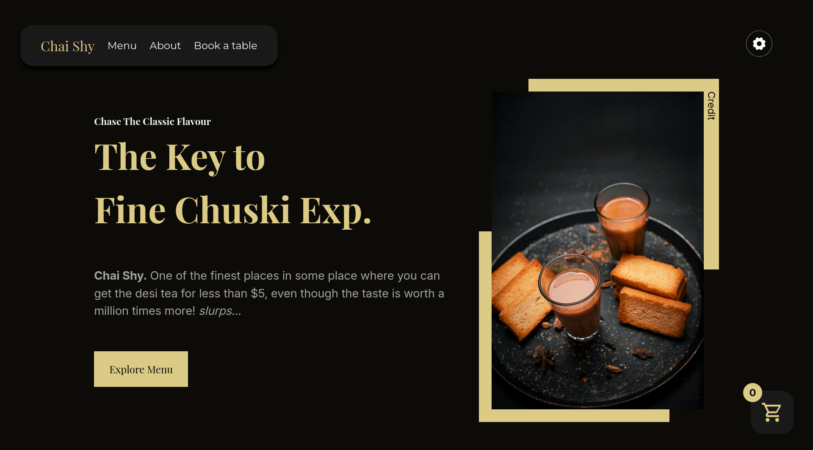

# CHAI SHY

  
Table of Contents

  <ol>
    <li>
      <a href="#about-the-project">About The Project</a>
      <ul>
        <li><a href="#built-with">Built With</a></li>
      </ul>
    </li>
    <li>
      <a href="#getting-started">Getting Started</a>
      <ul>
        <li><a href="#prerequisites">Prerequisites</a></li>
        <li><a href="#installation">Installation</a></li>
      </ul>
    </li>
    <li><a href="#usage">Usage</a></li>
    <li><a href="#roadmap">Roadmap</a></li>
    <li><a href="#contributing">Contributing</a></li>
    <li><a href="#license">License</a></li>
    <li><a href="#contact">Contact</a></li>
    <li><a href="#acknowledgments">Acknowledgments</a></li>
  </ol>

## About Chai Shy

Bringing back the traditional drink embraced in many cultures: chai (tea). This restaurant project is not just any ordinary site. It has many features combined with the perfect drink.

Here's why: 

- A satisfying user experience because of fun user experience.
- From managing profile to viewing order history.
- An admin dashboard with live stats.
- Live custom support chat.

While some features may look ordinary, they are not until you check them out!

(<a href="#readme-top">back to top</a>)

### Built With

* [![Typescript][TS]][TS-url]
* [![React][React.js]][React-url]
* [![Tanstack Router][tanstack-router]][tanstack-url]
* [![Express][express]][express-url]
* [![Vite][vite]][vite-url]

(<a href="#readme-top">back to top</a>)

[React.js]: https://img.shields.io/badge/React-20232A?style=for-the-badge&logo=react&logoColor=61DAFB
[React-url]: https://react.dev/
[TS]: https://img.shields.io/badge/TypeScript-3178C6?logo=typescript&logoColor=fff 
[TS-url]: https://www.typescriptlang.org/
[vite]: https://img.shields.io/badge/Vite-646CFF?logo=vite&logoColor=fff 
[vite-url]: https://vite.dev/ 
[express]: https://img.shields.io/badge/Express.js-%23404d59.svg?logo=express&logoColor=%2361DAFB
[express-url]: https://expressjs.com/
[tanstack-router]: https://img.shields.io/badge/tanstack-orange?logo=tanstack&logoColor=black
[tanstack-url]: https://tanstack.com/